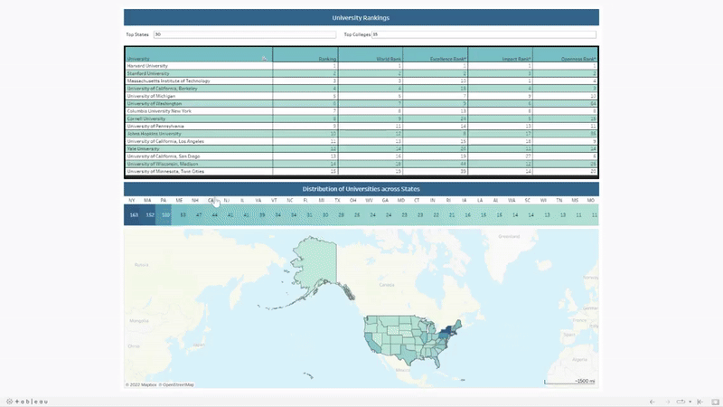

# Foundational Analytics Project: College Selection Decision Dashboard

  

## Foundational / Learning Analytics Project

## Business Problem
Prospective international students often rely heavily on university rankings when selecting colleges, but rankings alone lack geographic and regional context. Factors such as region, environment, proximity to facilities, and surrounding infrastructure significantly influence student life, employment opportunities, and overall well-being. The absence of integrated geographic insights makes informed decision-making difficult.

## Objective
To build an interactive, data-driven dashboard that combines university rankings with geographic and regional information, enabling students and advisors to make more informed college selection decisions.

## Target Users
1. Prospective international students
2. Academic advisors
3. Education consultants

## Data Sources
1. Publicly available university ranking data (web scraped)
2. Supplementary geographic and regional datasets, including states, towns, and coordinates

## Analytical Approach
This project follows a structured analytics lifecycle:

  1. Data extraction through web scraping and dataset integration
  2. Data enrichment using secondary geographic sources
  3. Data cleaning, validation, and de-duplication
  4. SQL-based aggregation and statistical analysis
  5. Interactive visualization and dashboard development

The focus was on building a coherent data pipeline from raw inputs to decision-ready insights.

## Key Analyses Performed
1. State-wise and town-wise distribution of universities
2. Regional concentration analysis
3. Statistical measures, including mean and median ranking distribution
4. Geographic mapping and drill-down analysis

## Dashboard Capabilities
1. Dynamic ranking selection using parameter controls
2. State-level heatmaps showing university concentration
3. Interactive geographic maps with regional context
4. Drill-down from state to town to individual universities
5. Cross-filtering between ranking tables, maps, and regional views
   
## Tools & Technologies
1. Python (Pandas, BeautifulSoup)
2. SQL
3. Excel
4. Tableau
   
## What This Project Demonstrates
1. End-to-end understanding of the analytics lifecycle
2. Ability to integrate multiple data sources into a unified analytical model
3. Data cleaning and validation discipline
4. Early experience in analytical storytelling and dashboard design
   
## Limitations & Learnings
As a foundational project, the solution prioritizes exploratory analysis and visualization over enterprise-grade data modeling and stakeholder-driven KPI validation. If rebuilt today, the project would incorporate clearer business requirements, standardized KPI definitions, and stronger normalization to better support scalability and decision governance.

## Walkthrough Demo

[**Final Project Walkthrough Video**](https://github.com/Vaibhav0000/foundational-analytics-college-selection-dashboard/blob/main/media/College%20Dashboard.mp4)

> Includes full explanation of methodology, findings, and dashboard tour.

---
## Contact

**Vaibhav Nangia**  
👨‍💼 Business Data Analyst | PMP-Certified Project Manager | BI Storyteller  
🔗 [LinkedIn](https://www.linkedin.com/in/vaibhavnangia08050805/)  
📧 [Email](mailto:nangiavaibhav9@gmail.com)
---
## Notes
This project represents an early-stage analytics exercise and reflects the development of core analytical thinking, data handling, and visualization skills.
